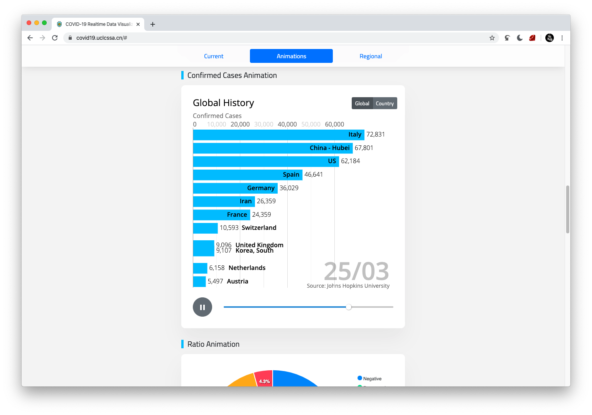

# COVID-19 Data Visualizer & Interactive Timeline

Coronavirus UK and world data visualiser with interactive timeline using vue and bootstrap

**[covid19track.site](https://covid19track.site/)**

Running on [covid19track.site](https://covid19track.site/) and [covid19.uclcssa.cn](https://covid19.uclcssa.cn).
## Screenshots
Charts and Data

Confirmed Cases Bar Race Animation

UK Region Map

Detailed Region List with Full History Timeline

Country Drop Down Select

## Copyright
You are free to distribute, share or embed whole or part of the site without prior notice to us, 
as long as you mention the source (covid19track.site or covid19.uclcssa.cn) or keep the about section 
intact. Please follow our Licence if you would like to modify the source code, it would also be very nice
 if you could show us what did you build :)

## Data Source
<ul>
    <li><a href="https://coronavirus.data.gov.uk/developers-guide">GOV.UK</a></li>
    <li><a href="https://github.com/CSSEGISandData/COVID-19">COVID-19 Data Repository - Johns Hopkins CSSE</a></li>
    <li><a href="https://apify.com/covid-19">COVID-19 Data APIs for statistics - APIFY</a></li>
    <li><a href="https://github.com/ExpDev07/coronavirus-tracker-api">Coronavirus Tracker API - ExpDev07</a></li>
    <li><a href="https://github.com/nytimes/covid-19-data">Coronavirus Data in the United States - The New York Times</a></li>
    <li><a href="https://gist.github.com/jrzief/70f1f8a5d066a286da3a1e699823470f">D3 Bar Chart Races (Based on) - jrzief</a></li>
    <li><a href="https://www.iconfinder.com/p/coronavirus-awareness-icons">Coronavirus Awareness Icons - iconfinder</a></li>
</ul>

Written for UCLCSSA, beautified version of v1.0 from DaviesXue: https://github.com/DaviesXue/UCLCSSA_COVID19
